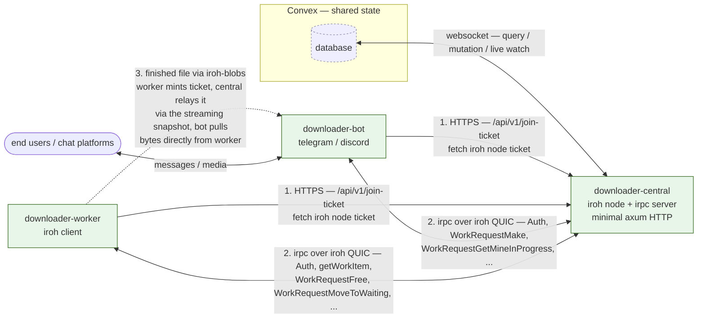

# Downloader Hub

[](https://github.com/allypost-org/downloader-hub/actions/workflows/deploy.yaml)

Docker images:

- `downloader-central` — [](https://hub.docker.com/r/allypost/downloader-central)
- `downloader-worker` — [](https://hub.docker.com/r/allypost/downloader-worker)
- `downloader-bot` — [](https://hub.docker.com/r/allypost/downloader-bot)

A distributed system for downloading media from various platforms (YouTube, Reddit, Twitter/X, Instagram, TikTok, Tumblr, Threads, Bluesky, Imgur, …), post-processing it into standard formats, and delivering it back to users via chat bots.

Downloaded files are extracted, downloaded (via `yt-dlp`), converted/normalized (`ffmpeg`), and optionally post-processed (scene splitting, OCR, background removal, cropping). A request can be submitted from a chat bot, picked up by a worker, processed, and the finished file streamed back over iroh — all without any of the components sharing a filesystem.

> **Note:** there is currently no web UI for the hub. All end-user interaction happens through the Telegram and Discord bots; everything else is driven by the API/RPC layer.

## Architecture

The project is a **Rust workspace** (edition 2024) of four binaries and nine library crates. Three of the binaries (`central`, `worker`, `bot`) form a peer-to-peer mesh over **[iroh](https://github.com/n0-computer/iroh)** QUIC connections, coordinated by `central`. State lives in a shared **[Convex](https://www.convex.dev/)** backend.



> `downloader-cli` is standalone — it calls `app-actions` locally and is not part of this mesh.

**Topology notes**

- **Only `central` talks to Convex.** Workers and bots have no database access at all; everything they need they get over the irpc control channel from `central`, which proxies Convex on their behalf.
- **Workers and bots never talk to each other over the control plane.** They are both irpc clients of `central` and are unaware of one another. `central` is the only irpc server.
- **Finished files travel worker → bot directly over iroh-blobs**, but the *coordination* is brokered by `central`: the worker mints an `IrohBlobTicket` (pointing at its own iroh address), sends it to `central` via irpc; `central` stores it in Convex and relays it to the bot through the `WorkRequestGetMineInProgress` streaming snapshot; the bot then opens a fresh iroh QUIC connection to the worker and pulls the bytes. `central` never stores or relays file bytes.
- **Bootstrap** — a worker/bot first hits `central`'s HTTPS `/api/v1/join-ticket` (validating its API key against Convex) to obtain the iroh node ticket, then dials `central` over QUIC and completes the `Auth` handshake. Dev also supports a direct-ticket join over LAN/mDNS.
- **Auth** — **API-key-at-connect**. The first irpc call is always `Auth { api_key, capabilities, version }`; `central` validates the key against Convex `downloader_hub_authed` and binds `{role, expiry}` to the connection. There are **no JWTs on the RPC path**.
- **Control RPC** — request/response over **`irpc`** riding iroh QUIC, ALPN `downloader-hub/rpc/1`.

See [`docs/plans/2026-07-01_14-54_move-control-rpc-to-irpc.md`](docs/plans/2026-07-01_14-54_move-control-rpc-to-irpc.md) for the full design (implemented 2026-07-01).

## The four binaries

Each binary has its own `AGENTS.md` with layout, entrypoints, and startup contracts.

| Binary | Role | In mesh? | Subcommands |
| --- | --- | --- | --- |
| `downloader-central` | iroh node + coordination point, irpc server, minimal HTTP surface | yes (server) | `run` |
| `downloader-worker` | performs downloads/processing via `app-actions` | yes (client) | `run`, `list { actions \| downloaders \| fixers \| all }` |
| `downloader-bot` | user-facing bot (Telegram + Discord) | yes (client) | `telegram`, `discord` |
| `downloader-cli` | local standalone tool | no | — (flat args) |

- **`downloader-central`** — the iroh coordination node. Serves the irpc control protocol (`app_peer_comms::rpc::CentralProtocol`), runs the `WorkDistributor` actor (parks workers on a blocking `getWorkItem` and pre-takes work on their behalf), watches Convex for session revocation, and exposes a minimal axum HTTP surface: `/api/v1/join-ticket` (bootstrap), `/api/v1/connections` (peer inventory), `/api/v1/metrics` (Prometheus), `/health`.
- **`downloader-worker`** — connects to `central`, authenticates, and runs a sequential loop: `getWorkItem` (blocks until handed an item it hasn't refused) → process or `refuse` → repeat. Also runs `app-tasks` cron jobs (e.g. `yt-dlp` auto-updates) and an expired-blob-tag cleanup loop.
- **`downloader-bot`** — multi-platform bot selected via a positional subcommand. Receives media/links from chat, creates work requests on `central`, and consumes a server-streaming `WorkRequestGetMineInProgress` irpc call to track and report progress. Telegram is built on `teloxide`, Discord on `serenity`.
- **`downloader-cli`** — a single-file local tool that directly invokes `app_actions::download_file` / `fix_file`. Reads URLs and/or local file paths, downloads concurrently, fixes/renames/splits as requested. No peer-comms, no Convex, no `app-logger`.

## The library crates (`crates/`)

- **`app-actions`** — core download/process pipeline: `extractors` (per-site URL → metadata) → `downloaders` (`yt_dlp`, `generic`, `music`) → `fixers` (filenames, extensions, media formats, cropping) → `actions` (split scenes, OCR, background removal, compact media, rename-to-id). Public entrypoints: `download_file()`, `fix_file()`.
- **`app-config`** — clap-derive config infra implementing the `Config::init_parsed()` / `Config::global()` singleton used by every binary. Shared groups in `src/common/`, opt-in per-binary blocks in `src/conditional/`.
- **`app-database`** — Rust client for Convex **and** the Convex TS backend itself (`convex/`). Connects over WebSocket; supports `query`, `mutation`, `watch_query` (live subscriptions).
- **`app-peer-comms`** — the iroh wrapper and irpc control protocol. Owns `PeeringEndpoint` (iroh `Endpoint` + `Router` + `Gossip` + `BlobsProtocol`), the `CentralProtocol` irpc enum, sessions, revocation, and work distribution.
- **`app-helpers`** — utilities: `config::init` (wires yt-dlp/ffmpeg/ffprobe paths), `futures` (`TaskController`, `retry_future`, `keep_running`), ffprobe/trash/temp-file helpers, async tree walker.
- **`app-logger`** — `tracing` initializer with separate stderr + optional file layers and a reloadable `EnvFilter` (`pretty`/`plain`/`json`).
- **`app-macros`** — proc-macros (`GlobalConfig`, `Dumpable`) backing the config singleton.
- **`app-requests`** — `reqwest` wrapper preconfigured with rustls + webpki roots.
- **`app-tasks`** — cron-style task runner spawned by the worker.

> `app-entities` is legacy/orphaned — see its `AGENTS.md`.

## Database: Convex

There is **no SQL database**. State lives in **Convex** (a hosted TypeScript reactive backend), accessed over WebSocket by all binaries through `app-database`. The schema (`crates/app-database/convex/schema.ts`) has four tables:

| Table | Purpose |
| --- | --- |
| `downloader_hub_authed` | API keys for workers/bots (stable identity, role, optional expiry) |
| `downloader_hub_requests` | the work queue (status: `pending`/`inProgress`/`done`/`failed`, `tries`, `refusedBy`, `errors`) |
| `downloader_hub_outbox` | messages broadcast to peer audiences |
| `downloader_hub_connections` | live connection inventory (which worker/bot is connected to which central, with capabilities) |

## Runtime dependencies

The worker (and CLI) shell out to these binaries:

- [yt-dlp](https://github.com/yt-dlp/yt-dlp) — download and process videos (required)
- [ffmpeg](https://ffmpeg.org/) — convert to standard formats (required)
- [ffprobe](https://ffmpeg.org/ffprobe.html) — media inspection (required)
- [scenedetect](https://scenedetect.com) — scene detection / splitting (optional)
- [imagemagick](https://imagemagick.org/) — image actions (optional)

Paths are auto-resolved from `$PATH` if not given explicitly.

## Getting started

### Prerequisites

- Rust **stable** (CI pins **1.96**), edition 2024
- [**`just`**](https://github.com/casey/just) — the task runner (preferred over raw `cargo`)
- [`watchexec`](https://github.com/watchexec/watchexec) — for dev auto-restart
- [`bun`](https://bun.sh/) — for the Convex dev server
- The runtime binaries above

Verify with `which just cargo watchexec bun`.

The build target and rustflags are pinned in `.cargo/config.toml` (`x86_64-unknown-linux-musl`, static linking, `--cfg tokio_unstable`); plain `cargo build`/`cargo run` pick these up automatically.

### Configuration

- `.env` at the repo root is the source of dev config but is **gitignored** — copy values from a teammate if missing. `just` auto-loads it.
- `crates/app-database/.env.local` holds the Convex deployment URL for `convex dev`.

### Common commands

```text
just dev-watch <package> [args...]   # run a binary with watchexec (auto-restart on change)
just dev-run    <package> [args...]   # run once without watching
just dev-build  <package> [args...]   # dev build of a single package

just build <bin>                      # release build of a binary (canonical production build)
just run   <bin> [args...]            # release build + run

just db-dev                           # Convex dev server (bun run dev in crates/app-database)
just fmt-dev                          # lint-fix + nightly fmt — the ONLY lint/format command to use
just install-cli                      # install downloader-cli (uses the release-cli profile)
```

> Prefer `just <recipe>` over raw `cargo`. In particular use `just fmt-dev` for all lint/fix operations — do **not** run `cargo fmt`, `cargo clippy`, `just fmt`, or `just lint` directly.

### Local dev orchestration

[`mprocs.yaml`](mprocs.yaml) defines five dev processes — `db`, `central`, `worker`, `bot-telegram`, `bot-discord` — with pinned `--peer-comms-secret-key` values (stable iroh node IDs for dev) and per-process blob stores under `./dev/peer-comms-blobs-store-*/`. Run them together with [`mprocs`](https://github.com/jpbochi/mprocs) (the `db` entry runs the Convex dev server).

### Trying the CLI

```bash
just install-cli                       # installs to ~/.cargo/bin (or $INSTALL_LOCATION)
downloader-cli -u 'https://youtu.be/...' -d ./out --and-rename
```

## Building & deploying

### Docker

A single unified `.docker/Dockerfile` plus [`docker-bake.hcl`](docker-bake.hcl) builds all three images — `downloader-central`, `downloader-worker`, `downloader-bot` — sharing `chef`/`planner`/`deps` stages so BuildKit compiles the workspace dependency graph exactly once.

```bash
just docker-build-all                  # build all images locally (--load)
just docker-build <target>             # build one of: bot | central | worker
just docker-release-all                # build + push all
```

The CLI is **not** dockerized; install it with `just install-cli`.

### CI / deploy

[`.github/workflows/deploy.yaml`](.github/workflows/deploy.yaml) triggers on push to `main`. It runs `docker buildx bake` (on a Blacksmith 4-vCPU runner, with an S3 BuildKit cache), pushes the three images to Docker Hub, and then pings a **Watchtower** webhook (`/v1/update`) to roll the deployment.

[`version-check.yaml`](.github/workflows/version-check.yaml) enforces that every PR touching `Cargo.toml`/`bins`/`crates` bumps the workspace `version` strictly above `main`.

### Release profiles

- `release` — `lto = "thin"`, `codegen-units = 1`, `strip = true` (central/worker/bot).
- `release-cli` — inherits `release` plus `opt-level = "s"`, `lto = true`, `panic = "abort"` (only for `just install-cli`).

## License

[MPL-2.0](LICENSE).
